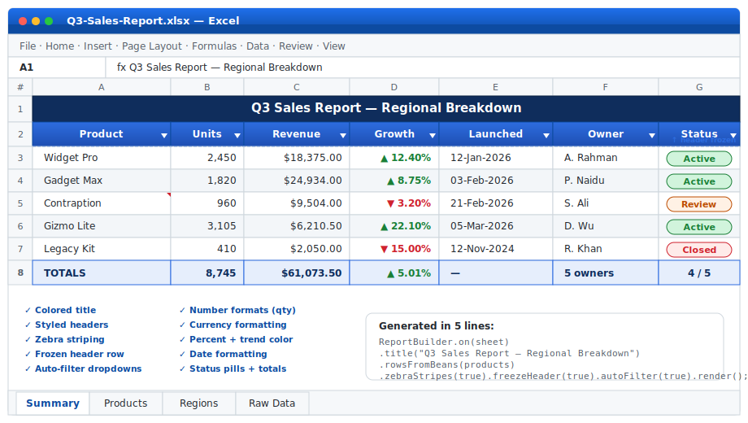
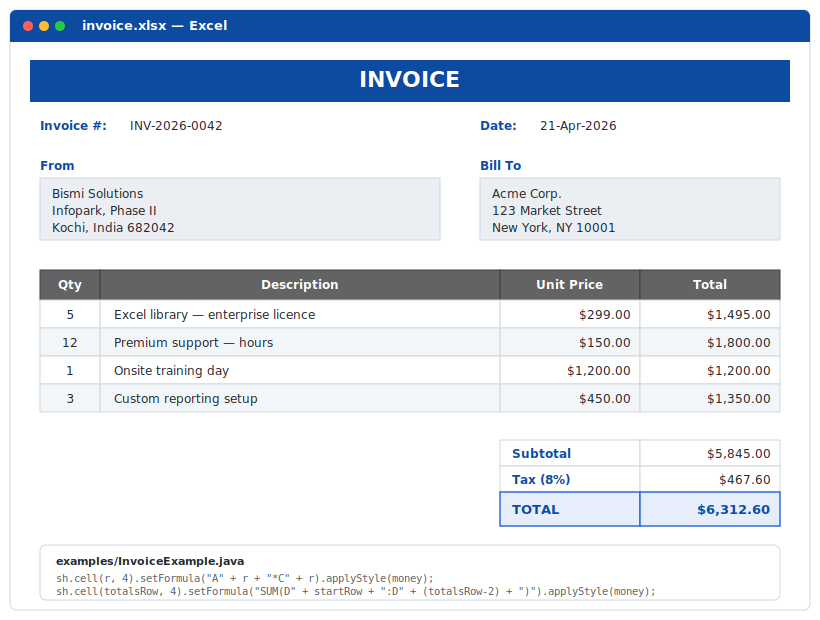
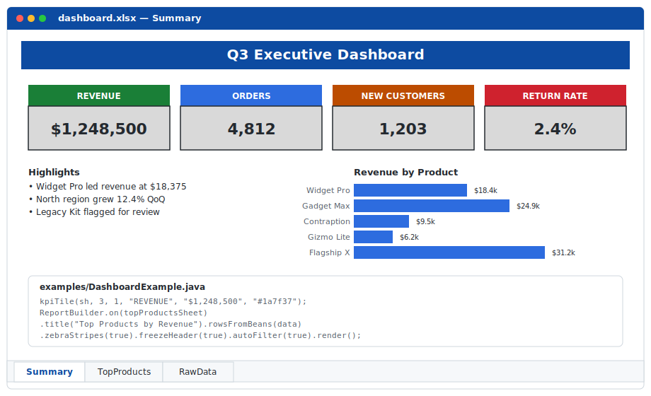
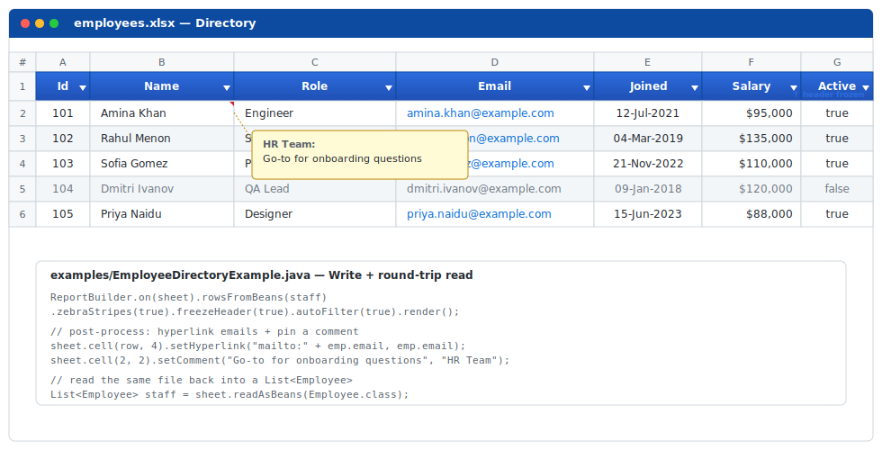
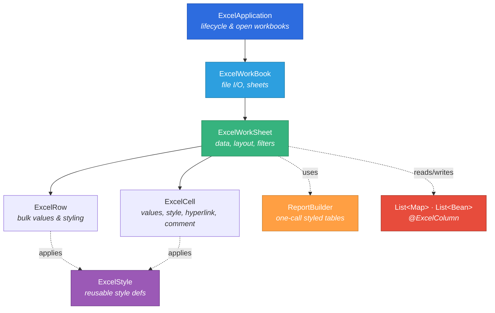
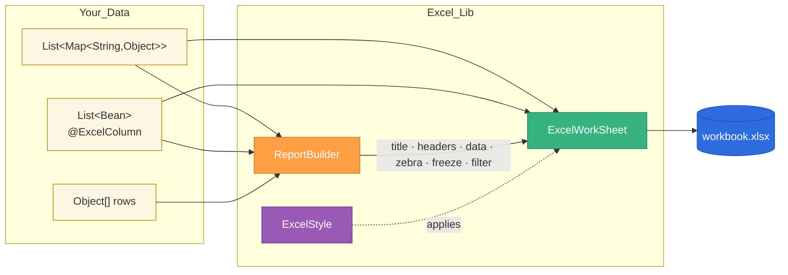

# Excel 📈

<div align="center">

<h3><em>Ship a styled Excel report in 5 lines — skip the 60 lines of Apache POI boilerplate.</em></h3>

[](https://github.com/Bismi-Solutions/Excel/actions/workflows/ci.yml)
[](https://codecov.io/gh/Bismi-Solutions/Excel)
[](https://sonarcloud.io/project/overview?id=Bismi-Solutions_Excel)
[](https://snyk.io/test/github/Bismi-Solutions/Excel?targetFile=pom.xml)
[](https://search.maven.org/artifact/solutions.bismi.excel/excel)
[](https://opensource.org/licenses/MIT)
[](https://openjdk.java.net/)

</div>

```java
ReportBuilder.on(sheet)
    .title("Q3 Sales Report")
    .rowsFromBeans(products)      // ← your List<Bean>
    .zebraStripes(true).freezeHeader(true).autoFilter(true)
    .render();
```

**Result:**

<p align="center">
  
</p>

---

## 🤔 Why *Excel*, not Apache POI directly?

POI is powerful — and verbose. Every styled cell forces you through the same choreography: `CreationHelper` → `CellStyle.cloneStyleFrom` → `DataFormat` → `Font` → manual type dispatch (`setCellValue(String)` vs `setCellValue(double)` vs `setCellValue(Date)`) → `CellRangeAddress` → `createFreezePane` → `setAutoFilter`.

Most business-Excel tasks boil down to **"take a list of objects and make it look like a report."** *Excel* gives you **one call** for that, while still exposing the POI workbook for edge cases.

### What you skip

| You no longer juggle | Because *Excel* handles it |
|---|---|
| Creating/cloning `CellStyle` for every cell | `ExcelStyle` — build once, apply everywhere |
| Hitting POI's **64K-CellStyle quota** in big reports | Reused immutable styles by design |
| Casting between `HSSFWorkbook` / `XSSFWorkbook` for hex colours | Auto-detects format; hex falls back to nearest indexed on `.xls` |
| `FileInputStream` / `FileOutputStream` lifecycle | Opened and closed internally |
| `setCellValue` type dispatch | `setValue(Object)` — accepts `String`, `Number`, `Boolean`, `Date`, `LocalDate`, `null` |
| 0-based POI indexes | 1-based public API (matches Excel UI) |
| Bean-to-sheet and sheet-to-bean loops | `@ExcelColumn` + `writeBeans` / `readAsBeans` |

### ⏱️ Time saved (measured in lines of code)

| Task | Apache POI | **Excel** | Ratio |
|---|---:|---:|---:|
| Create `.xlsx` + write "Hello World" with a style | ~15 | **5** | **3×** |
| Write `List<Bean>` as a styled, filtered, frozen table | ~60 | **5** | **12×** |
| Apply one reused style to 1,000 cells | ~8 / cell (repeat loops) | **1** | ≫10× |
| Read sheet into `List<Map<String,String>>` | ~30 | **1** | **30×** |
| Round-trip `List<Bean>` → file → `List<Bean>` | ~80 | **2** | **40×** |
| Freeze header + auto-filter + column widths | ~20 | **3** | **7×** |

---

## 🚀 Jump-away examples

### 1 · Hello, styled workbook (6 lines)

```java
ExcelApplication app = new ExcelApplication();
ExcelWorkBook wb = app.createWorkBook("demo.xlsx");
ExcelWorkSheet sh = wb.addSheet("Summary");
sh.cell(1,1).setText("Hello World").applyStyle(ExcelStyle.header());
wb.saveWorkbook();
app.closeAllWorkBooks();
```

### 2 · Bean → styled report (one call)

```java
public class Product {
    @ExcelColumn(name = "SKU",   order = 1)                      String sku;
    @ExcelColumn(name = "Item",  order = 2)                      String name;
    @ExcelColumn(name = "Units", order = 3, format = "#,##0")    int    units;
    @ExcelColumn(name = "Price", order = 4, format = "$#,##0.00") double price;
}

ReportBuilder.on(sheet)
    .title("Catalog")
    .rowsFromBeans(productList)
    .zebraStripes(true).freezeHeader(true).autoFilter(true)
    .render();
```

### 3 · `List<Map>` → spreadsheet

```java
List<Map<String,Object>> rows = List.of(
    Map.of("Item","Apple", "Qty",10, "Price",1.20),
    Map.of("Item","Pear",  "Qty", 8, "Price",1.80));

sheet.writeMaps(rows).freezePane(2,1).autoSizeAllColumns();
```

### 4 · Read Excel → `List<Bean>`

```java
List<Product> products = sheet.readAsBeans(Product.class);   // headers → fields
```

### 5 · Reusable style, applied 1,000 times

```java
ExcelStyle money = ExcelStyle.builder()
        .numberFormat("$#,##0.00").horizontalAlignment("RIGHT").fullBorder("black").build();

for (int r = 2; r <= 1001; r++) {
    sheet.cell(r, 3).setValue(revenue[r-2]).applyStyle(money);   // one style, many cells
}
```

### 6 · Hyperlinks & comments

```java
sheet.cell(1,1).setHyperlink("https://bismi.solutions", "Bismi Solutions");
sheet.cell(1,1).setComment("Official site", "Release notes");
```

---

## 🖼️ Runnable examples (each image is produced by the linked file)

Every example below is a real file under [`examples/`](examples) that you can run with
`mvn compile exec:java -Dexec.mainClass=<className>`. Each screenshot is a faithful
mock of the workbook it produces — colours, zebra, freeze pane, auto-filter, and all.

### 📦 Invoice — merged title · address blocks · line items · formulas · totals

<p align="center">
  
</p>

> Source: [`examples/InvoiceExample.java`](examples/InvoiceExample.java) ·
> Showcases: cell merging · reusable label/address/currency styles · formulas (`A*C`, `SUM`, tax) · bordered totals row · column widths.

---

### 📊 Executive Dashboard — KPI tiles · chart-ready sheet · raw data

<p align="center">
  
</p>

> Source: [`examples/DashboardExample.java`](examples/DashboardExample.java) ·
> Showcases: 4 colour-coded KPI tiles (green/blue/orange/red) built from merged cells ·
> second sheet with `ReportBuilder` top-products table · third sheet with mixed-type raw data · frozen header + auto-filter.

---

### 👥 Employee Directory — beans + hyperlinks + comments + round-trip read

<p align="center">
  
</p>

> Source: [`examples/EmployeeDirectoryExample.java`](examples/EmployeeDirectoryExample.java) ·
> Showcases: `@ExcelColumn` beans · zebra stripes · frozen header · auto-filter ·
> `mailto:` hyperlinks on the email column · greyed-italic style for inactive rows ·
> cell comment with author · **round-trip read back into `List<Employee>` via `readAsBeans`**.

---

### 🗂️ Three-in-one Collection Report — beans, maps, raw

> Source: [`examples/CollectionReportExample.java`](examples/CollectionReportExample.java) ·
> Sheet 1 uses `ReportBuilder.rowsFromBeans(List<Product>)`, sheet 2 uses `rowsFromMaps(List<Map>)`
> with a currency override on column 3, sheet 3 uses the bare-minimum `sheet.writeMaps(...)`.

---

## 📦 Installation

### Maven
```xml
<dependency>
  <groupId>solutions.bismi.excel</groupId>
  <artifactId>excel</artifactId>
  <version>1.2.0</version>
</dependency>
```

### Gradle (Kotlin DSL)
```kotlin
implementation("solutions.bismi.excel:excel:1.2.0")
```

### Gradle (Groovy DSL)
```groovy
implementation "solutions.bismi.excel:excel:1.2.0"
```

**Requires:** Java 17+  ·  Works on Windows · macOS · Linux.

---

## ☑️ Features at a glance

| Area | What's in the box |
|---|---|
| 📑 **Workbook** | create · open · save · `.xlsx` + `.xls` |
| 📄 **Sheets** | add · rename · activate · freeze panes · auto-filter · protect (password) |
| 📝 **Cells** | text · numbers · dates · formulas · **polymorphic `setValue(Object)`** · hyperlinks · comments |
| 🎨 **Styling** | fonts · 52 named colours ✨ · hex colours (XLSX) · borders · alignment · number formats · **reusable `ExcelStyle`** + presets |
| 📋 **Rows/Cols** | bulk values (mixed types) · auto-fit · column width · range styling |
| 🔗 **Merge/Unmerge** | succinct helpers · overlap safety checks |
| 🗂️ **Collections** | `writeMaps` · `writeBeans` · `readAsMaps` · `readAsBeans` · `@ExcelColumn` annotation |
| 🏗️ **Reports** | `ReportBuilder` — title · headers · zebra · freeze · auto-filter · per-column formats · column widths |
| 🧪 **Quality** | 91 unit tests (incl. every README snippet) · CI · Codecov · Sonar · Snyk |

---

## 🗺️ Architecture



Each class exposes only methods appropriate to its scope — code completion *is* your documentation.

### Data-flow for a collection-driven report



---

## 🧱 Style reuse at a glance

```java
ExcelStyle header = ExcelStyle.header();         // grey fill · white bold · centred · bordered
ExcelStyle zebra  = ExcelStyle.zebraStripe();    // light-grey fill
ExcelStyle money  = ExcelStyle.currency();       // right-aligned $#,##0.00
ExcelStyle pct    = ExcelStyle.percent();        // right-aligned 0.00%
ExcelStyle when   = ExcelStyle.date();           // dd-MMM-yyyy

ExcelStyle custom = ExcelStyle.builder()
        .fontColor("white").fillColor("#0d4ba1")
        .bold(true).horizontalAlignment("CENTER").fullBorder("black")
        .build();
```

Apply to anything:

```java
sheet.row(1).applyStyle(header);
sheet.row(5).applyStyle(money, 2, 6);            // cells 2..5 of row 5
sheet.cell(10,3).applyStyle(money);              // single cell
```

---

## 🤝 Contributing

```bash
git clone https://github.com/Bismi-Solutions/Excel.git
cd Excel
mvn test        # 91 tests — all green is the baseline
```

PRs welcome. Please include unit tests and follow the log-level convention:

- **info** → user-visible events (file created, sheet saved)
- **debug** → flow diagnostics
- **warn/error** → exceptional situations

Area ideas that need love: charts · conditional formatting · data validation (dropdowns) · named ranges · images · pivot tables.

---

## 📄 License

MIT — *use it, fork it, profit.* See [LICENSE](LICENSE).
